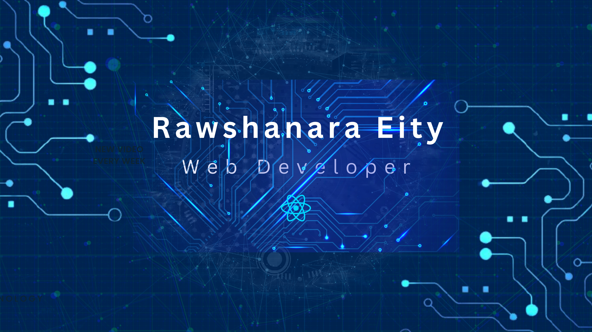

### Hi 👋, I'm Rawshanara Eity

- 🔭 I’m currently working on various projects using the MERN stack. 
- 🌱 I’m currently learning Material UI and exploring Next.js

- 👯 I'm looking to collaborate on dynamic projects and contribute to a vibrant team environment.

- 🤔 **Seeking Opportunities:** Open to job roles or internships where I can continue learning and making a positive impact.

**🚀 Technology Stack:**

**🚀 Rawshanara Eity's GitHub Stats**

**🚀💻 Projects**

**💻 MediCamp**

 ### [🌐 Live Link](https://medicamp-management-client.web.app)

### Features
* In our website you can explore different Medical Campaign Experience.
* You can see Full Details information about our campaign .
* If you are interested You can Participate our campaign.
* Interesting payment system.
* Organizer can add camp and also update if they need.

🛠️ **Tech Stack:**
JavaScript, React, Tailwind, Express.js, MongoDB, Firebase, Node.js

